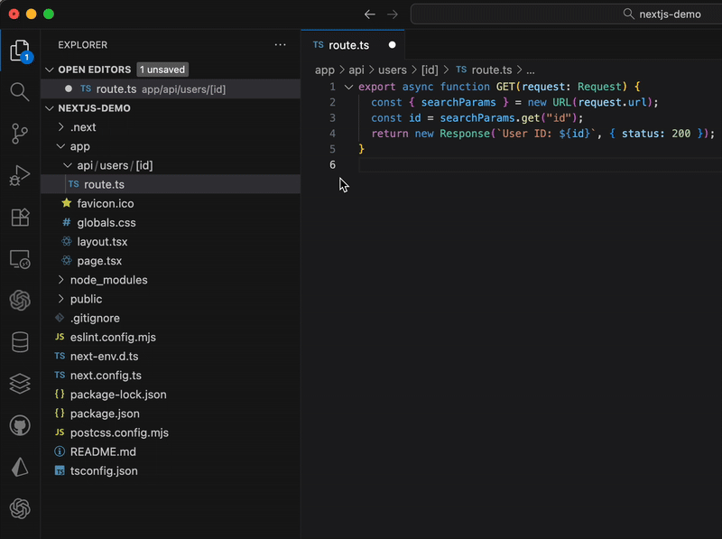

# 🧭 Route Comment — VS Code Extension

> **Instantly see, copy, and open your Next.js route — right from the file.**



> Route Comment automatically inserts a route comment at the top of your file (e.g. `// /api/posts/[id]`)
> and lets you open it directly in your browser with one click.

---

## ✨ Features

| Feature                          | Description                                                                                                         |
| -------------------------------- | ------------------------------------------------------------------------------------------------------------------- |
| 💬 **Auto-insert route comment** | Generates a route based on your file path and inserts it at the top of the file.                                    |
| 🌐 **Open in browser**           | Opens the derived route using your configured `baseUrl` (defaults to `http://localhost:3000`).                      |
| 📋 **Copy route**                | Copies the route (e.g. `/api/users/[id]`) to your clipboard.                                                        |
| ⚙️ **Configurable**              | Choose whether to include `/app`, control comment style, and toggle status bar visibility.                          |
| 👀 **CodeLens & status bar**     | Small in-editor actions appear above your route comment for quick access.                                           |
| 🚀 **App Router aware**          | Understands special files like `page.tsx`, `layout.tsx`, and ignores group segments like `(marketing)` or `@modal`. |

---

## 🧠 Example

When editing this file:

```
app/blog/[slug]/page.tsx
```

Route Comment will insert:

```ts
// /blog/[slug]
```

…and display inline CodeLens actions:

```
Copy Route | Open in Browser | Refresh Route
```

---

## ⚡️ Quick Start

### 1. Install

Search for **Route Comment** in the [VS Code Marketplace](https://marketplace.visualstudio.com/items?itemName=AndreasJakobsen.vscode-route-comment)
or run:

```bash
ext install andreasjakobsen.vscode-route-comment
```

### 2. Open any route file

Open any route file in your Next.js project (e.g. `app/api/users/[id]/route.ts`).
Press ⌘ + ⌥ + R (Mac) or Ctrl + Alt + R (Windows/Linux).

### 3. A route comment appears at the top of the file.

### 4. Hover above it to see CodeLens actions:

- Copy Route
- Open in Browser
- Refresh Route

---

## 🧩 Configuration

| Setting                          | Type    | Default                   | Description                                                                                         |
| -------------------------------- | ------- | ------------------------- | --------------------------------------------------------------------------------------------------- |
| `routeComment.includeAppSegment` | boolean | `true`                    | Include the `/app` directory in the route (`// /app/api/...`). Turn off for canonical Next.js URLs. |
| `routeComment.commentStyle`      | string  | `"slash"`                 | Choose `slash`, `hash`, `block`, or `auto`.                                                         |
| `routeComment.openBaseUrl`       | string  | `"http://localhost:3000"` | The base URL used by **Open in Browser**.                                                           |
| `routeComment.statusBar`         | boolean | `true`                    | Show or hide the status bar action.                                                                 |

Open settings → search “Route Comment” → adjust to your workflow.

---

## 💡 Tips

The extension works for TypeScript, JavaScript, TSX, JSX, and MDX files.

If your project uses App Router groups ((marketing) folders) or parallel routes (@modal), they are automatically skipped in the generated path.

If you rename a file, run “Route Comment: Insert or Update” again to refresh the comment.

---

## 🔗 Commands

| Command                           | Description                                      | Shortcut                       |
| --------------------------------- | ------------------------------------------------ | ------------------------------ |
| `Route Comment: Insert or Update` | Inserts or updates the route comment at the top. | `Ctrl + Alt + R` / `⌘ + ⌥ + R` |
| `Route Comment: Copy Route`       | Copies the derived route to clipboard.           | —                              |
| `Route Comment: Open in Browser`  | Opens the route using your configured base URL.  | —                              |

---

## ⚙️ Example Configuration in settings.json

```json
{
  "routeComment.includeAppSegment": false,
  "routeComment.commentStyle": "slash",
  "routeComment.openBaseUrl": "http://localhost:3000",
  "routeComment.statusBar": true
}
```

---

## 🧱 Example Project Structure

```bash
my-next-app/
└── app/
    ├── layout.tsx
    ├── page.tsx
    ├── api/
    │   ├── users/
    │   │   └── [id]/
    │   │       └── route.ts
    └── blog/
        └── [slug]/
            └── page.tsx
```

Editing `app/api/users/[id]/route.ts` will create:

```ts
// /api/users/[id]
```
